# Overview

  
  
  
  
  
  

Pagser is a medium-sized web application with around 20 thousand lines of code and 80 HTTP routes. It is built with React (with Redux), Node.js (Cpeak) and Postgres. It is a content sharing platform that allows users to create and share content, follow other users, and interact with each other. The app is built with a focus on performance, scalability, and security.

## Some Features

- Full-fledged user authentication and authorization completely powered by Cpeak, with Forgot Password, Email Verification, and more.
- File uploading, image cropping and resizing.
- AWS S3 integration for file storage (page photos, thumbnails, collection photos, profile photos and attach files), and SES for email sending.
- Creating public and private pages and sharing content, images, attached files, and more.
- Each page can have comments and ratings enabled, and people can reply to other comments.
- Pages can be organized in collections.
- In short, a person can start a full blogging platform with this app, or a knowledge sharing platform, and more.

---

The styling is done with pure CSS.

---

## Cpeak for Backend

Cpeak is a zero-dependency Node.js framework that powers the backend. Before Cpeak, the app was built with Express. Here on the left is how the `package.json` file of the server looked before switching to Cpeak, and on the right is how it looks now. As you can see, we went from roughly 20 dependencies to just 10, not to mention close to a dozen `@types` packages that were dropped too. Cpeak has all the features of Express and more, including cookie parsing, authentication, compression, JSON body parsing, HTTP routing and more. It is built with performance in mind, and it has surpassed the performance of Express.js, and it's getting close to the performance of Fastify.

  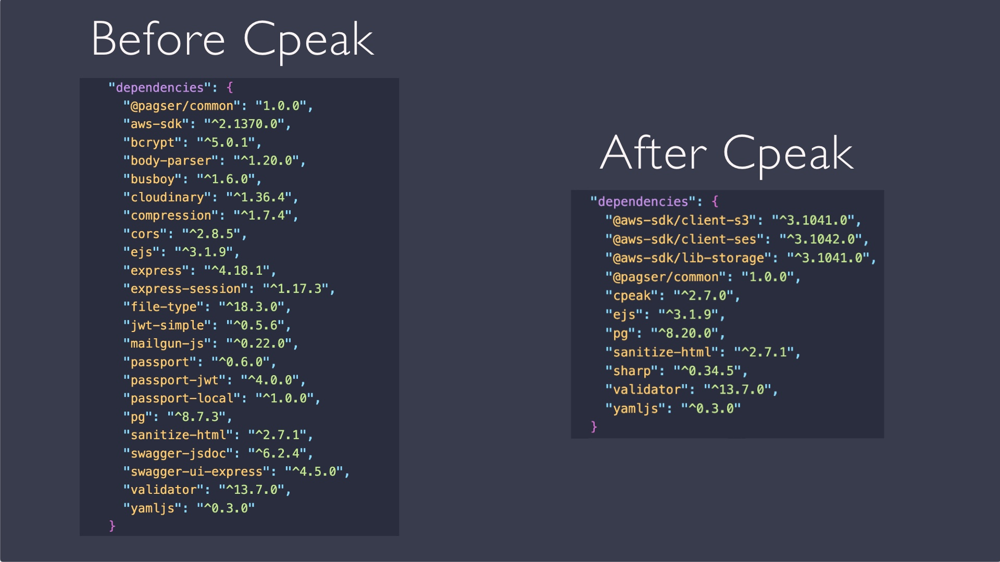

---

## App Screenshots

  <a href="docs/readme-images/login.png">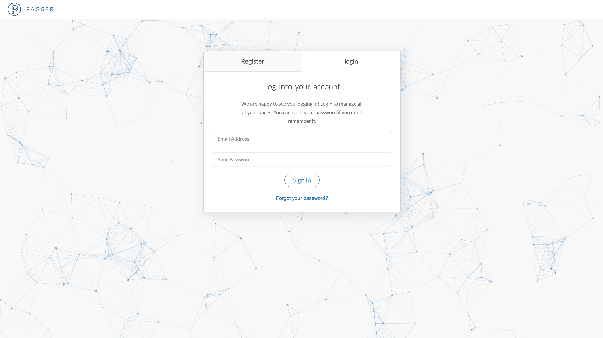</a>
  <a href="docs/readme-images/verify-email.png">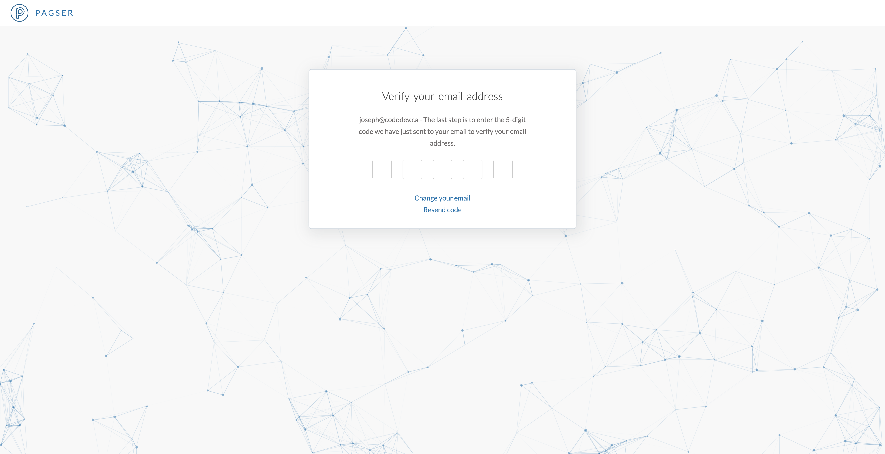</a>

  <a href="docs/readme-images/pages.png">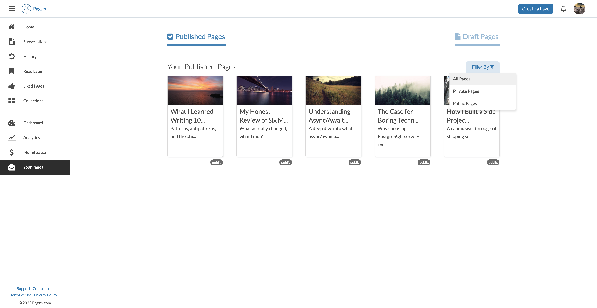</a>
  <a href="docs/readme-images/show-page.png">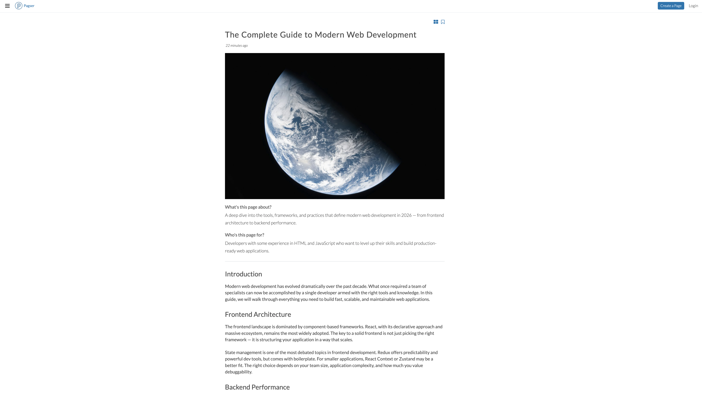</a>

  <a href="docs/readme-images/creating-a-page.png">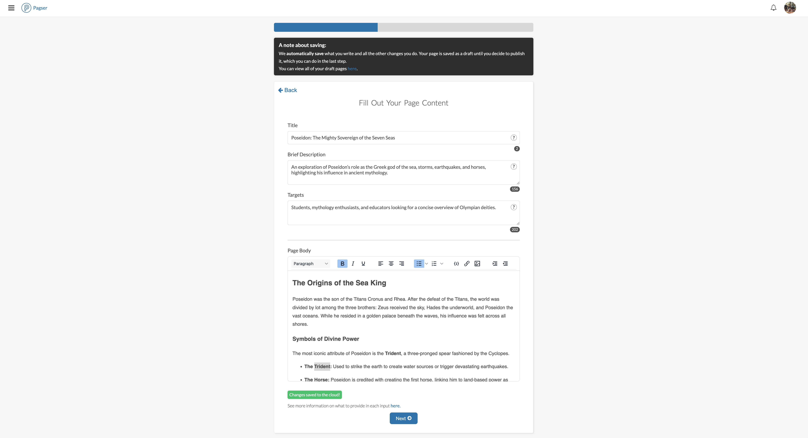</a>
  <a href="docs/readme-images/creating-a-page-thumbnail.png">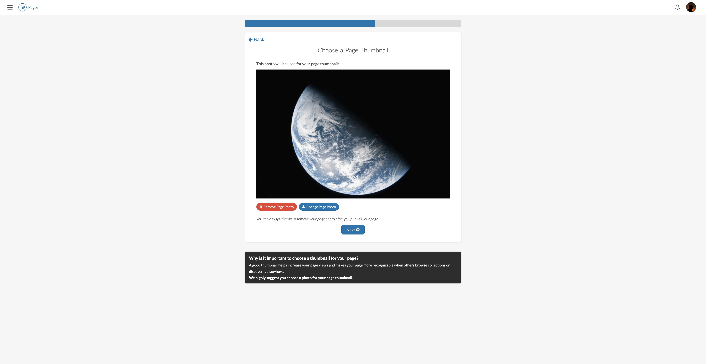</a>

  <a href="docs/readme-images/creating-a-page-final.png">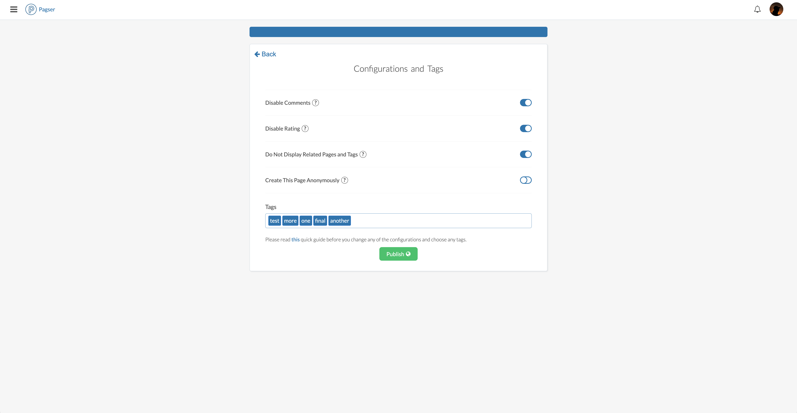</a>
  <a href="docs/readme-images/public-profile.png">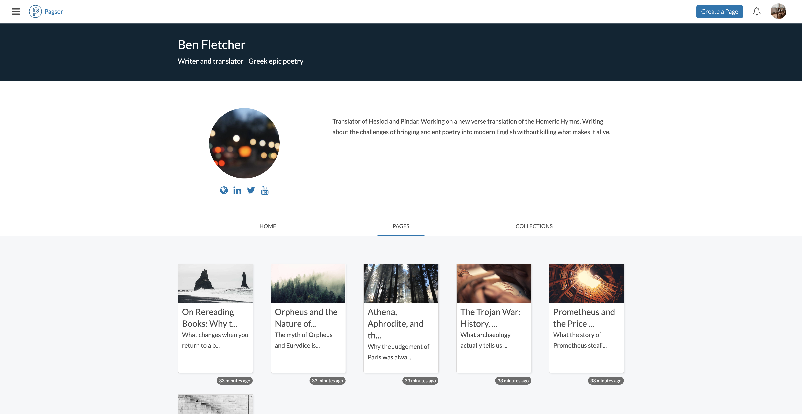</a>

  <a href="docs/readme-images/upload-profile-photo.png">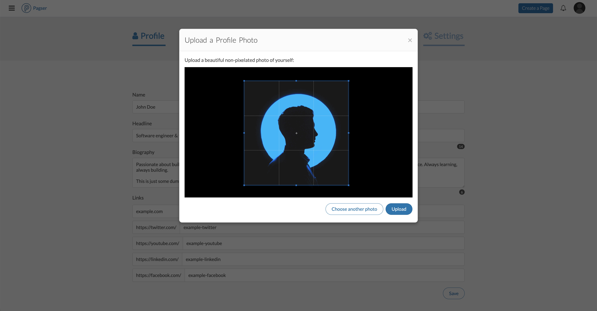</a>
  <a href="docs/readme-images/collection-edit.png">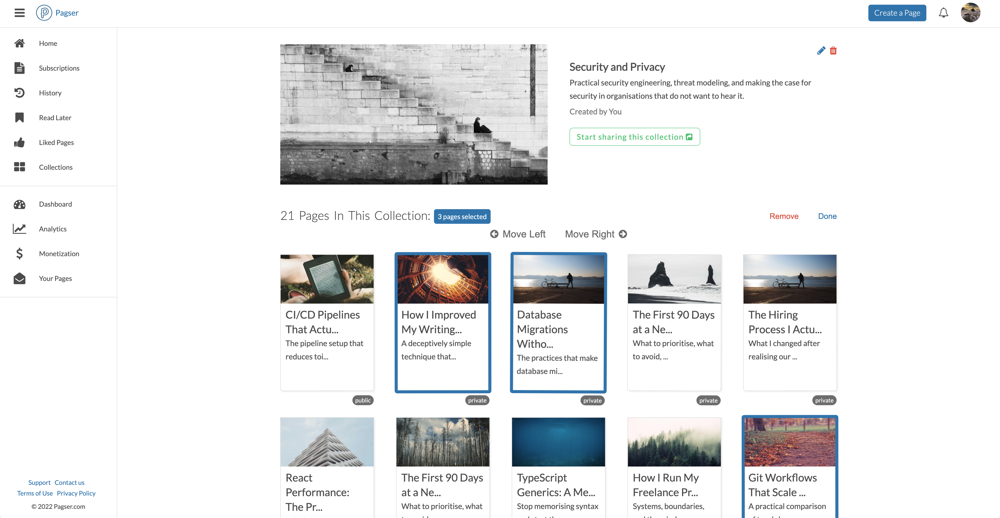</a>

## Setup and Usage

Instructions on how to navigate the codebase, build the project, run the tests, Swagger and more will be added here soon. The app is in development, but you can go to [pagser.com](https://pagser.com) and check out some of the features. Please report any bugs in the GitHub Issues section.

---

Thank you for checking out the project!
